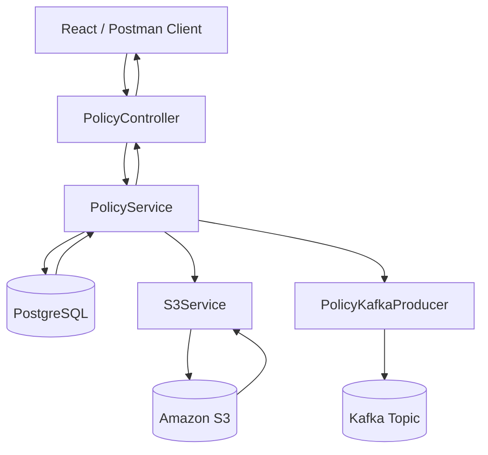

# Policy Pulse API

Policy Pulse API is a Spring Boot backend for managing insurance policy records and policy documents.

The application supports policy CRUD operations, paginated listing, status-based search, AWS S3 document upload/download, and Kafka event publishing after a policy document is uploaded.

---

## Features

- Create, read, update, and delete policy records
- Get paginated policy listings
- Search policies by status
- Upload policy documents to Amazon S3
- Download policy documents from Amazon S3
- Store only the S3 document key in PostgreSQL
- Publish a Kafka event after successful document upload
- Validate request data using Jakarta Bean Validation
- Manage database schema using Flyway migrations
- Support local frontend integration through CORS

---

## Tech Stack

| Area | Technology |
|---|---|
| Language | Java 17 |
| Backend Framework | Spring Boot |
| REST API | Spring Web |
| Database | PostgreSQL |
| ORM | Spring Data JPA / Hibernate |
| Database Migration | Flyway |
| Cloud Storage | Amazon S3 |
| AWS SDK | AWS SDK v2 |
| Messaging | Apache Kafka |
| Validation | Jakarta Bean Validation |
| Build Tool | Maven |

---

## Architecture



---

## Project Structure

```text
src/main/java/com/policypulse/api
├── Policy.java
├── PolicyController.java
├── PolicyRepository.java
├── PolicyService.java
├── S3Config.java
├── S3Service.java
├── PolicyDocumentUploadedEvent.java
└── PolicyKafkaProducer.java
```

---

## Main Concepts

### Policy Entity

`Policy.java` represents one policy record in the database.

Main fields:

| Field | Purpose |
|---|---|
| `id` | Primary key |
| `policyNumber` | Unique policy number |
| `holderName` | Name of the policy holder |
| `status` | Policy status such as `ACTIVE`, `PENDING`, or `EXPIRED` |
| `premium` | Policy premium amount |
| `documentKey` | S3 object key of the uploaded document |
| `createdAt` | Record creation timestamp |
| `updatedAt` | Last update timestamp |

---

## Document Storage Design

The actual document file is stored in Amazon S3.

The database does **not** store the full file. It stores only the S3 object key in the `document_key` column.

Example:

```text
S3 bucket:
1714450000000_policy.pdf

PostgreSQL policy table:
document_key = 1714450000000_policy.pdf
```

This keeps the database lightweight and lets S3 handle file storage.

---

## Kafka Event Flow

After a policy document is uploaded successfully, the application publishes a Kafka event.

Example event:

```json
{
  "eventType": "POLICY_DOCUMENT_UPLOADED",
  "policyId": 10,
  "policyNumber": "POL101",
  "documentKey": "1714450000000_policy.pdf",
  "uploadedAt": "2026-05-10T10:30:00Z"
}
```

This event can later be consumed by another service, such as:

- Audit service
- Notification service
- Reporting service
- Document processing service

---

## API Endpoints

Base URL:

```text
http://localhost:8080
```

| Method | Endpoint | Description |
|---|---|---|
| `GET` | `/api/policies?page=0&size=10` | Get paginated policies |
| `POST` | `/api/policies` | Create a new policy |
| `GET` | `/api/policies/{id}` | Get policy by ID |
| `PUT` | `/api/policies/{id}` | Update policy by ID |
| `DELETE` | `/api/policies/{id}` | Delete policy by ID |
| `GET` | `/api/policies/search?status=ACTIVE&page=0&size=10` | Search policies by status |
| `POST` | `/api/policies/{id}/document` | Upload a document for a policy |
| `GET` | `/api/policies/{id}/document` | Download a policy document |

---

## Sample Requests

### Create Policy

```http
POST /api/policies
Content-Type: application/json
```

Request body:

```json
{
  "policyNumber": "POL101",
  "holderName": "John Doe",
  "status": "ACTIVE",
  "premium": 500.00
}
```

---

### Get Paginated Policies

```http
GET /api/policies?page=0&size=10
```

Example response:

```json
{
  "content": [
    {
      "id": 1,
      "policyNumber": "POL101",
      "holderName": "John Doe",
      "status": "ACTIVE",
      "premium": 500.00,
      "documentKey": null
    }
  ],
  "totalPages": 1,
  "totalElements": 1,
  "number": 0,
  "size": 10,
  "first": true,
  "last": true
}
```

---

### Search Policies by Status

```http
GET /api/policies/search?status=ACTIVE&page=0&size=10
```

---

### Upload Policy Document

```http
POST /api/policies/1/document
Content-Type: multipart/form-data
```

Form data:

```text
file = policy-document.pdf
```

Flow:

```text
Client uploads file
-> PolicyController receives request
-> PolicyService validates policy
-> S3Service uploads file to Amazon S3
-> PostgreSQL stores the S3 document key
-> Kafka event is published
```

---

### Download Policy Document

```http
GET /api/policies/1/document
```

Flow:

```text
Client requests download
-> PolicyController receives request
-> PolicyService gets document key from database
-> S3Service downloads file bytes from S3
-> Controller returns the file as a downloadable response
```

---

## Configuration

Add the required configuration in `application.yml`.

```yaml
server:
  port: 8080

spring:
  datasource:
    url: jdbc:postgresql://localhost:5432/policy_pulse
    username: your_db_username
    password: your_db_password

  jpa:
    hibernate:
      ddl-auto: validate
    show-sql: true

  flyway:
    enabled: true

aws:
  s3:
    bucket-name: your-s3-bucket-name

kafka:
  bootstrap-servers: localhost:9092
  topic:
    document-uploaded: policy-document-uploaded
```

---

## Local Setup

### Prerequisites

- Java 17
- Maven
- PostgreSQL
- AWS credentials configured locally
- S3 bucket created in AWS
- Kafka running locally or available through a reachable bootstrap server

---

### Database Setup

Create a PostgreSQL database:

```sql
CREATE DATABASE policy_pulse;
```

Flyway will run the migration scripts when the application starts.

---

### AWS S3 Setup

Create an S3 bucket in AWS and update the bucket name in `application.yml`.

The application uses `S3Client` to upload and download policy documents from the configured bucket.

---

### Kafka Setup

Run Kafka locally or provide a reachable Kafka bootstrap server.

Example:

```yaml
kafka:
  bootstrap-servers: localhost:9092
```

The producer sends document upload events to the configured topic:

```text
policy-document-uploaded
```

---

## Run the Application

Using Maven:

```bash
mvn spring-boot:run
```

Using Maven Wrapper on Windows:

```powershell
mvnw.cmd spring-boot:run
```

Using Maven Wrapper on macOS/Linux:

```bash
./mvnw spring-boot:run
```

The backend runs on:

```text
http://localhost:8080
```

---

## Frontend CORS

The backend allows requests from the local React/Vite frontend:

```text
http://localhost:5173
```

This allows the Policy Pulse UI to call the Spring Boot API during local development.

---

## Application Flows

### Create Policy

```text
Frontend/Postman
-> PolicyController
-> PolicyService
-> PolicyRepository
-> PostgreSQL
```

### Upload Document

```text
Frontend/Postman
-> PolicyController
-> PolicyService
-> S3Service
-> Amazon S3
-> PostgreSQL stores document key
-> Kafka event is published
```

### Download Document

```text
Frontend/Postman
-> PolicyController
-> PolicyService
-> PostgreSQL gets document key
-> S3Service downloads file from Amazon S3
-> Controller returns downloadable file
```

---

## Notes

- The actual policy document is stored in Amazon S3.
- PostgreSQL stores only the S3 object key.
- Kafka is used to publish an event after successful document upload.
- Validation is handled using annotations such as `@NotBlank`, `@NotNull`, `@Size`, and `@DecimalMin`.
- Flyway manages database schema changes.
- The React frontend can call the API through the configured CORS origin.

---

## Future Improvements

- Add global exception handling with standardized error responses
- Add Swagger/OpenAPI documentation
- Add unit and integration tests
- Add Testcontainers for PostgreSQL/Kafka testing
- Add Docker Compose for PostgreSQL and Kafka
- Add authentication and authorization
- Add CloudWatch logging and monitoring
- Add CI/CD deployment pipeline
- Add file type and file size validation for uploads

---

## License

This project is for learning and portfolio development.
